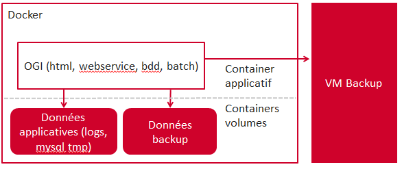

= Docker

== Builder les images depuis zéro

Les images se basent sur une debian wheezy.

    docker pull debian:wheezy

Le logiciel OGI se base sur 3 images docker :
  
  * **java8-mysql-tomcat** : comme son nom l'indique elle contient les logiciels java8, mysql et tomcat. Une configuration minimale est appliquée (utilisateur admin pour mysql par exemple)
  * **ogi-base** : configuration des logiciels pour OGI (utilisateur mysql, classpath tomcat ...)
  * **ogi** : image finale contenant le logiciel OGI
  
Le build depuis zéro se résume en 3 commandes docker :

   cd docker
   docker build -t jerep6/java8-mysql-tomcat:1.0 BaseImage/
   docker build -t jerep6/ogi-base:1.0 OGIBase/
   docker build -t jerep6/ogi:4.5.0 OGI/

Le dernier build nécessite l'enveloppe de livraison d'une version d'OGI. Cette enveloppe doit être généré avec le profile maven "delivery". Elle doit être placée au même niveau que le Dockerfile et s'appeler OGI
   
   
== Lancer OGI
Pour lancer le logiciel OGI, il suffit d'instancier l'image ogi. Avant cela, il est conseillé de lancer deux conteneurs afin d'héberger les données (logs, bdd ...) et les backups

  # conteneur pour les données
  docker run --name=data -v /data busybox:buildroot-2014.02
	
	# conteneur pour les backups
	docker run --name=backup -v /data/backup busybox:buildroot-2014.02
    
	# conteneur applicatif
	docker run --rm -e RSYNC_PASSWORD="pwd for backup" --volumes-from data --volumes-from backup -p 50901:3306 -p 50900:8080 -ti jerep6/ogi:4.5.0
	
